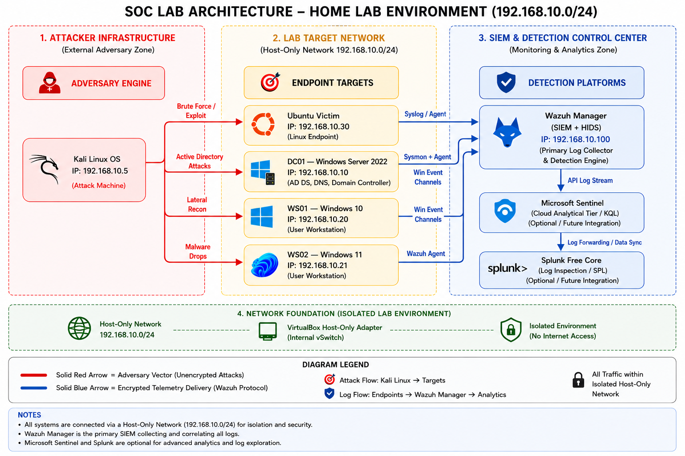

# Lab Architecture

## Build Status

| Component | Status |
|---|---|
| Kali Linux (Attacker) | ✅ Running |
| Ubuntu Server (Victim) | ✅ Running |
| Windows Server 2022 (DC01) | ✅ Running |
| Windows 10 (WS01) | ✅ Running |
| Windows 11 (WS02) | ✅ Running |
| Wazuh SIEM Manager | ✅ Running |
| Host-Only Network (192.168.10.0/24) | ✅ Configured |
| VM Connectivity (ping tests) | ✅ Verified |
| Wireshark on Kali | ✅ Actively capturing |

## Environment

| Machine | OS | Role | IP |
|---|---|---|---|
| Kali-Attacker | Kali Linux | Attacker | 192.168.10.5 |
| Ubuntu-Victim | Ubuntu Server 22.04 | Linux Target | 192.168.10.30 |
| DC01-Server | Windows Server 2022 | Domain Controller (SOC.LAB) | 192.168.10.10 |
| WS01-Client | Windows 10 | Domain Workstation 1 | 192.168.10.20 |
| WS02-Client | Windows 11 | Domain Workstation 2 | 192.168.10.21 |
| Wazuh-SIEM | Ubuntu Server 22.04 | SIEM / XDR | 192.168.10.100 |

## Network Design
- All VMs connected via VirtualBox Host-Only Network (192.168.10.0/24)
- Isolated environment — no internet access for victim/target machines
- Kali and Wazuh have NAT adapter for internet access
- Domain: SOC.LAB
- Wireshark running on Kali to capture all inter-VM traffic

## Lab Topology

