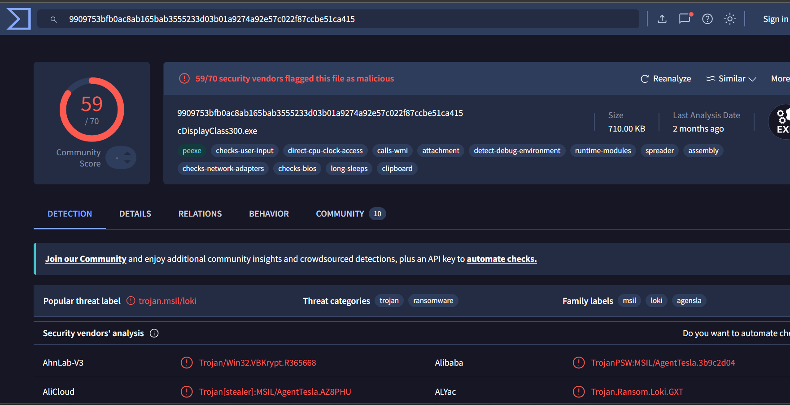

# Incident Report — Business Email Compromise / Malicious Attachment

**Platform:** LetsDefend — Email Analysis Challenge
**Badge:** Header Analyst
**Date Investigated:** 2026-10-03
**Analyst:** Shakshi Sona
**Status:** TRUE POSITIVE — Escalated

---

## 1. Executive Summary

An email claiming to be a business inquiry ("united scientific equipment") was submitted for analysis. The message carried an executable attachment disguised as a business document, which VirusTotal confirmed as a malicious trojan (59/70 vendor detections). The case was classified as a **True Positive** — malspam delivering a trojan payload via a disguised executable attachment.

## 2. Timeline of Events

| Time (UTC) | Event |
|---|---|
| 2021-02-08 23:15:11 -0800 | Email composed, `Date` header timestamp |
| 2021-02-09 07:15:10 +0000 | Email received by mail server (`Received` header) |
| 2026-10-03 | Email submitted for SOC analysis (lab exercise) |

## 3. Attack Methodology (MITRE ATT&CK)

| Technique | ID | Notes |
|---|---|---|
| Phishing: Spearphishing Attachment | T1566.001 | Malicious `.exe` delivered as an email attachment disguised as a business document |
| User Execution: Malicious File | T1204.002 | Requires victim to open the attachment to detonate |
| Masquerading | T1036 | Attachment filename ("united scientific equipment.exe") does not match the binary's internal name (`cDisplayClass300.exe`), indicating deliberate disguise |

## 4. Log Evidence — Email Headers
Return-Path: yanting@united.com.sg\
Received: from united.com.sg (unknown [71.19.248.52])\
From: "Yan Ting" yanting@united.com.sg\
To: admin@malware-traffic-analysis.net\
Subject: united scientific equipment\
Date: 08 Feb 2021 23:15:11 -0800\

**Key observations:**
- `From` and `Return-Path` share the same address (`yanting@united.com.sg`) — no spoofing indicator here on its own.
- The **real anomaly**: the `Received` line shows the message originated from IP `71.19.248.52`, which the receiving mail server could not resolve as belonging to `united.com.sg` (flagged `unknown`). This mismatch suggests either a spoofed `From` header or a compromised relay sending on the domain's behalf.
- Geolocation of `71.19.248.52` resolves to Canada, inconsistent with a `.sg` (Singapore) business domain — a secondary supporting indicator, not conclusive on its own.
- SPF/DKIM/DMARC alignment results were not available in the lab artifact; in a live environment this would be the first thing pulled to confirm the spoofing hypothesis.

## 5. Threat Intelligence Enrichment

| Indicator | Source | Result |
|---|---|---|
| `71.19.248.52` | VirusTotal / AbuseIPDB | Clean at time of check (lab sample — no live reputation) |
| `yanting@united.com.sg` | hunter.io | No reputation data (lab sample) |
| Attachment SHA256: `9909753bfb0ac8ab165bab3555233d03b01a9274a92e57c022f87ccbe51ca415` | VirusTotal | **59/70 vendors flagged malicious** — "trojan.msil/loki", families: Loki, AgentTesla |

**Note:** IP and sender reputation came back clean because this is an archived lab sample rather than a live threat — expected for training data, but in a production SOC a clean reputation check on a newly-registered or rarely-seen sender would not clear the email; the attachment verdict overrides it.

## 6. IOC Table

| Type | Value | Verdict |
|---|---|---|
| Sender address | yanting@united.com.sg | Suspicious (claimed domain doesn't align with originating IP) |
| Originating IP | 71.19.248.52 | Unresolved against sender domain |
| Attachment (displayed name) | united scientific equipment.exe | Masquerading |
| Attachment (internal/true name) | cDisplayClass300.exe | — |
| SHA256 | 9909753bfb0ac8ab165bab3555233d03b01a9274a92e57c022f87ccbe51ca415 | **Malicious — Trojan (Loki/AgentTesla family)** |
| Threat label | trojan.msil/loki | Confirmed via VirusTotal (59/70) |

## 7. Root Cause

A malspam email impersonating a legitimate business inquiry was used to deliver an executable disguised as a document. The disguise relies on the victim trusting the displayed filename and subject line without inspecting the actual file type or verifying sender infrastructure.

## 8. Impact Assessment (if this were production)

If executed by a recipient, this payload (Loki/AgentTesla family — commonly an info-stealer/keylogger) would likely result in credential theft, exfiltration of browser/email stored credentials, and potential follow-on access for the threat actor. No containment evidence suggests this is a pre-execution interception (email flagged before user interaction).

## 9. Recommendations

- Block sender domain/IP at the email gateway pending further validation.
- Quarantine and hash-block the attachment across endpoint/EDR.
- Run SPF/DKIM/DMARC checks on inbound mail from unfamiliar domains before delivery.

## 10. Lessons Learned

- A matching `From`/`Return-Path` does not rule out spoofing — the originating IP vs. claimed domain is the stronger signal and should be checked first.
- Always verify a suspicious attachment's **true internal filename** via sandboxing/VirusTotal metadata, not just the displayed name — disguise is the primary masquerading signal here, independent of the hash verdict.
- Clean reputation on sender IP/email doesn't equal benign — attachment analysis should never be skipped even if upstream indicators look clean.

---

## Escalation Ticket

- **Severity:** High
- **Summary:** Malspam email with disguised malicious executable attachment (Loki/AgentTesla trojan family)
- **Evidence:** SHA256 `9909...1ca415` flagged by 59/70 AV vendors; sender domain/IP mismatch in headers; attachment display name does not match internal binary name
- **Verdict:** True Positive
- **Action Taken:** Quarantined email and attachment; blocked hash and sender IOC
- **Recommendation:** Block sender domain pending SPF/DKIM review; push hash to EDR blocklist; user awareness notice on disguised attachments
